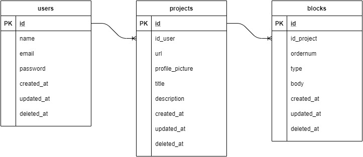

# chocolate-waffle

## Overview
This project aims to clone shorby.com for education purpose and still in very early state, if you want to contribute please [Open Issue](https://github.com/billysutomo/chocolate-waffle/issues/new/choose) or Merge Request.

## Quick Start
* web visit [README](./web/README.md)
* service visit [README](./web/README.md)

## Tech Stack
### UI
* TypeScript
* React
* Redux
* styled-component
### Service
* Golang
* Postgre

## ERD

### List Table
#### users
Manage users data and credential
* id: primary key
* name: user name
* password: user password
#### projects
each user can have one or more projects
* id: primary key
* id_user: user foreign key, define which user project belonging
* url: unique url for this project
* profile_picture: profile picture url path 
* title: project title
* description: project description
#### blocks
Each project can have one or more blocks. 
* id: primary key
* id_project: project foreign key, define which project block belonging
* ordernum: blocks ordering number from top to bottom
* type: blocks type, [messenger, block, social_link]
* body: json information, define by view

## Migration

This project use migration tools dbmate
1. Please install dbmate https://github.com/amacneil/dbmate
2. Run `dbmate migrate`
